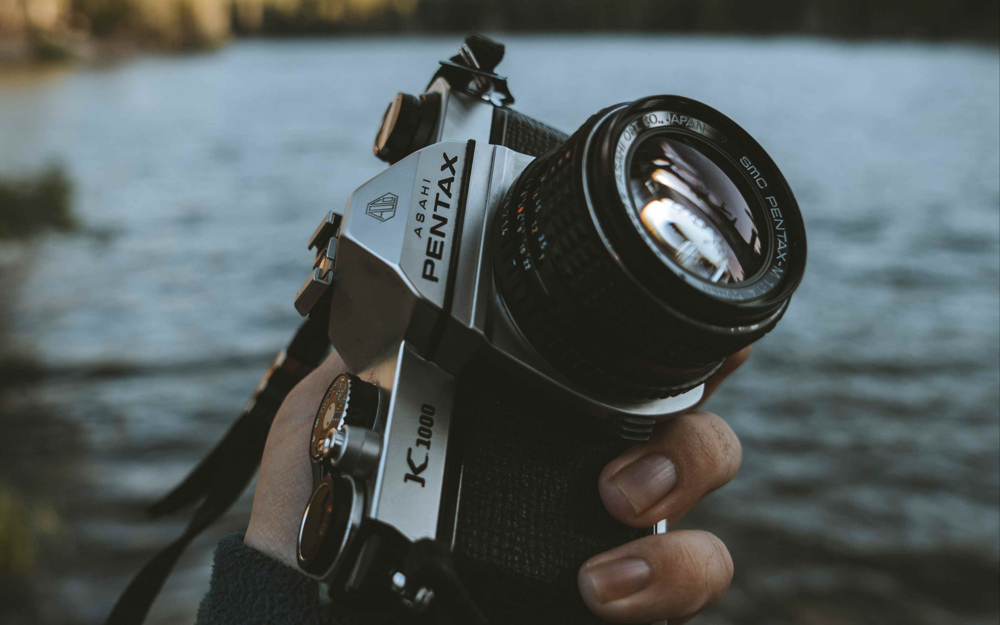

# Киноклуб "ОДИССЕЯ" - Веб-приложение


Веб-приложение для киноклуба "Одиссея" с функционалом фотогалереи, списка фильмов и информации о клубе.

## 📌 О проекте

Киноклуб "Одиссея" - это платформа для:
- Организации встреч киноманов
- Ведения архива обсужденных фильмов
- Публикации фотографий с мероприятий
- Отображения топ-рейтингов фильмов

## ✨ Особенности

### 🎬 Основные функции
- **Фотогалерея** с фильтрацией по категориям (встречи, вылазки, хобби и др.)
- **Топ-рейтинги** фильмов, режиссеров и жанров
- **Архив обсуждений** с детальной информацией о каждом фильме
- **Адаптивный дизайн** для всех устройств
- **Интерактивные элементы** (модальные окна, анимации)

### 🛠 Технологии
- **Frontend**: HTML5, CSS3, JavaScript (ES6+)
- **Стили**: CSS-переменные, Flexbox, Grid, анимации
- **Доступность**: ARIA-атрибуты, семантическая верстка
- **Оптимизация**: Lazy loading, preload критичных ресурсов

## 📸 Фотогалерея



Особенности галереи:
- Фильтрация по 9 категориям
- Поиск по названиям фотографий
- Модальное окно для просмотра в полном размере
- Адаптивная сетка изображений
- Эффекты наведения

## 🎥 Фильмы и рейтинги


Функционал:
- Сортировка по дате обсуждения (новые сверху)
- Пагинация с кнопкой "Показать еще"
- Детальная информация о каждом фильме
- Визуализация рейтинга звездами
- Топ-10 фильмов, режиссеров и жанров

## 🚀 Запуск проекта

1. Клонируйте репозиторий:
   ```bash
   git clone https://github.com/your-repo/odyssey-cinema-club.git

   ## 🧑‍💻 Автор

<div align="center">
  
  
  ### Станислав Лабенский
  **Middle QA Engineer (Manual/Automation/API)**
</div>

## 📍 Контакты:

📧 Email	bin.b@bk.ru

📱 Telegram	<a href="https://t.me/GeekLS" target="_blank" class="contact-item">@GeekLS</a>

☎️ Телефон <a href="" target="_blank" class="contact-item">+7(978)7975 939</a>

<div align="center"> <a href="stanislav.html">  </a> </div> 